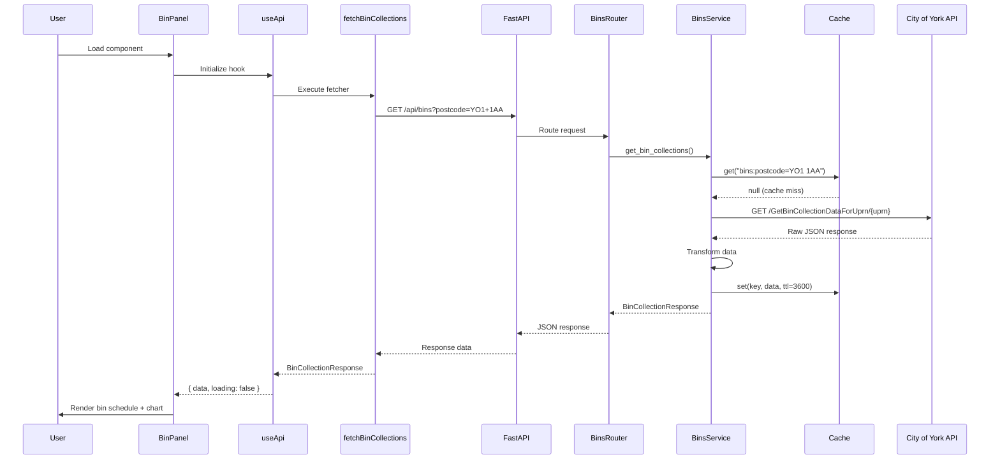
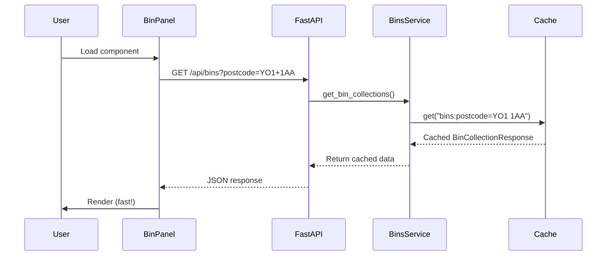
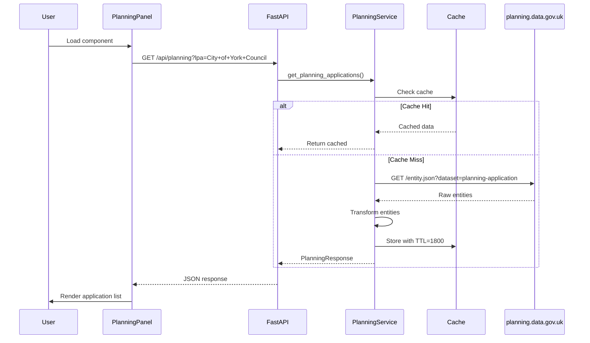
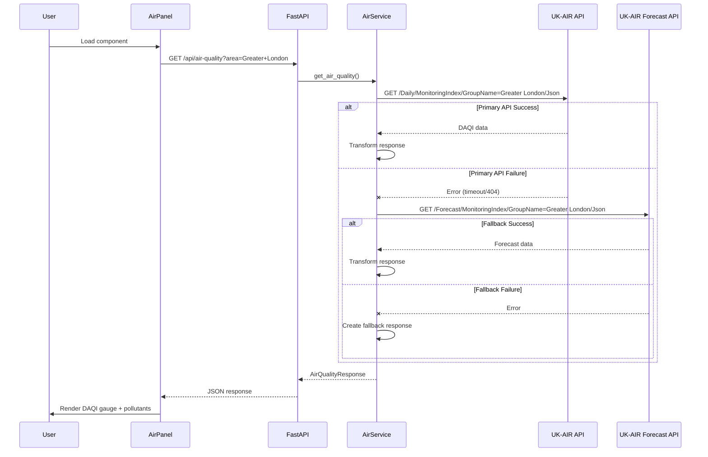

# System Flow

This document describes the data flow, sequence diagrams, and system interactions for the Local Council Data Explorer.

## Table of Contents

- [Overview](#overview)
- [User Interaction Flows](#user-interaction-flows)
- [Sequence Diagrams](#sequence-diagrams)
- [Data Transformation Flows](#data-transformation-flows)
- [State Management](#state-management)
- [Error Handling Flows](#error-handling-flows)
- [Caching Flows](#caching-flows)

---

## Overview

The Local Council Data Explorer follows a request-response pattern where user interactions trigger API calls that flow through multiple layers before returning data to the UI. This document visualizes these flows using Mermaid diagrams and textual descriptions.

---

## User Interaction Flows

### Application Startup Flow

When a user first loads the application:

```
┌─────────────┐     ┌─────────────┐     ┌─────────────┐     ┌─────────────┐
│   Browser   │────▶│   Vite Dev  │────▶│    React    │────▶│   Layout    │
│   Request   │     │   Server    │     │    App.tsx  │     │  Component  │
└─────────────┘     └─────────────┘     └─────────────┘     └─────────────┘
                                               │
                                               ▼
                                        ┌─────────────┐
                                        │  useApi     │
                                        │  Hooks x3   │
                                        │             │
                                        │ bins/       │
                                        │ planning/   │
                                        │ air quality │
                                        └─────────────┘
                                               │
                                               ▼
                                        ┌─────────────┐
                                        │   Parallel  │
                                        │ API Fetches │
                                        └─────────────┘
```

### Tab Navigation Flow

When a user switches between tabs:

```
User clicks "Planning" tab
        │
        ▼
Layout.onTabChange("planning")
        │
        ▼
App.setActiveTab("planning")
        │
        ▼
App.useMemo recalculates activePanel
        │
        ▼
PlanningPanel renders with cached data
        │
        └── If no cached data → API fetch triggered
```

---

## Sequence Diagrams

### Bin Collection Data Fetch (Cache Miss)



### Bin Collection Data Fetch (Cache Hit)



### Planning Applications Fetch



### Air Quality Fetch with Fallback



---

## Data Transformation Flows

### Bin Collection Data Transformation

```
CITY OF YORK API RESPONSE                    INTERNAL MODEL
─────────────────────────                    ──────────────
{                                            BinCollectionResponse:
  "bins": [                                    address: "10 Example St, York"
    {                                          council: "City of York Council"
      "binType": "GREY BIN",        ─────▶     bins: [
      "nextCollectionDate":                      BinCollection:
        "2025-12-09T00:00:00"                      type: "Refuse"
    },                                             collection_date: "2025-12-09"
    {                                            BinCollection:
      "binType": "GREEN BIN",                      type: "Recycling"
      "nextCollectionDate":                        collection_date: "2025-12-16"
        "2025-12-16T00:00:00"                  ]
    }
  ]
}

TRANSFORMATION STEPS:
1. Extract bins array from response
2. Map "GREY BIN" → "Refuse" using BIN_TYPE_MAPPING
3. Parse ISO datetime → YYYY-MM-DD format
4. Sort bins by collection date
5. Wrap in BinCollectionResponse model
```

### Planning Data Transformation

```
PLANNING.DATA.GOV.UK RESPONSE               INTERNAL MODEL
───────────────────────────────             ──────────────
{                                           PlanningResponse:
  "entities": [                               lpa: "City of York Council"
    {                                         applications: [
      "entity": 12345,                          PlanningApplication:
      "reference": "23/12345/FUL",  ─────▶       reference: "23/12345/FUL"
      "name": "Planning at 12 Rd",               address: "12 Example Road"
      "entry-date": "2025-11-10",               proposal: "Extension..."
      "planning-decision": ""                    status: "Pending"
    }                                            received_date: "2025-11-10"
  ],                                         ]
  "count": 100                               total_count: 1
}

TRANSFORMATION STEPS:
1. Extract entities array
2. Map each entity to PlanningApplication
3. Extract address from "name" field
4. Normalize status values
5. Parse and validate dates
6. Sort by received_date (newest first)
```

### Air Quality Data Transformation

```
UK-AIR API RESPONSE                          INTERNAL MODEL
──────────────────                           ──────────────
{                                            AirQualityResponse:
  "DailyAirQualityIndex": {                    area: "Greater London"
    "@ForecastDate": "2025-12-03",             max_daqi: 4
    "LocalAuthority": [                        summary: "Moderate"
      {                                        forecast_date: "2025-12-03"
        "Site": [                              pollutants: [
          {                                      Pollutant:
            "Species": [             ─────▶        name: "NO2"
              {                                    value: 42.0
                "@SpeciesCode": "NO2",             units: "µg/m³"
                "@Value": "42.0",                  band: "Moderate"
                "@AirQualityIndex": "3",           index: 3
                "@AirQualityBand": "Low"         Pollutant:
              },                                   name: "PM2.5"
              {                                    ...
                "@SpeciesCode": "PM2.5",       ]
                ...
              }
            ]
          }
        ]
      }
    ]
  }
}

TRANSFORMATION STEPS:
1. Navigate nested structure to Species arrays
2. Parse numeric values from strings
3. Deduplicate pollutants (keep worst reading)
4. Calculate max DAQI from all pollutants
5. Map index to summary band
6. Sort pollutants by severity
```

---

## State Management

### Frontend State Flow

```
┌─────────────────────────────────────────────────────────────────┐
│                         App Component                           │
│                                                                 │
│   State:                                                        │
│   ┌──────────────────┐                                          │
│   │ activeTab: TabId │  ◀──── setActiveTab from onTabChange    │
│   └──────────────────┘                                          │
│                                                                 │
│   Hooks (each manages independent state):                       │
│   ┌──────────────────────────────────────────────────────────┐ │
│   │  binsApi = useApi(binFetcher)                            │ │
│   │    ├── data: BinCollectionResponse | null                │ │
│   │    ├── loading: boolean                                  │ │
│   │    ├── error: string | null                              │ │
│   │    ├── refetch: () => Promise<void>                      │ │
│   │    └── reset: () => void                                 │ │
│   └──────────────────────────────────────────────────────────┘ │
│   ┌──────────────────────────────────────────────────────────┐ │
│   │  planningApi = useApi(planningFetcher)                   │ │
│   │    └── (same structure as above)                         │ │
│   └──────────────────────────────────────────────────────────┘ │
│   ┌──────────────────────────────────────────────────────────┐ │
│   │  airApi = useApi(airFetcher)                             │ │
│   │    └── (same structure as above)                         │ │
│   └──────────────────────────────────────────────────────────┘ │
│                                                                 │
│   Memoized Panel Selection:                                     │
│   ┌──────────────────────────────────────────────────────────┐ │
│   │  activePanel = useMemo(() => {                           │ │
│   │    switch(activeTab) {                                   │ │
│   │      case 'bins': return <BinPanel {...binsApi} />       │ │
│   │      case 'planning': return <PlanningPanel .../>        │ │
│   │      case 'air': return <AirQualityPanel .../>           │ │
│   │    }                                                     │ │
│   │  }, [activeTab, binsApi, planningApi, airApi])           │ │
│   └──────────────────────────────────────────────────────────┘ │
└─────────────────────────────────────────────────────────────────┘
```

### useApi Hook State Transitions

```
Initial State          On Execute            On Success           On Error
────────────────       ────────────          ────────────         ──────────
{                      {                     {                    {
  data: null,    ──▶     data: null,   ──▶     data: result, or     data: prev,
  loading: true,         loading: true,        loading: false,      loading: false,
  error: null            error: null           error: null          error: message
}                      }                     }                    }

                                    ▲                      ▲
                                    │                      │
                            refetch() ──────────── Retry on error
```

---

## Error Handling Flows

### Backend Error Propagation

```
External API Error
        │
        ▼
┌─────────────────────────────────────────────────────────────────┐
│ Service Layer Exception Handling                                │
│                                                                 │
│  try:                                                           │
│      response = await client.get(url)                           │
│      response.raise_for_status()                                │
│  except httpx.TimeoutException:                                 │
│      # Log and re-raise for router                              │
│      raise                                                      │
│  except httpx.HTTPStatusError as e:                             │
│      if e.response.status_code == 404:                          │
│          return fallback_response()  # Graceful degradation     │
│      raise                                                      │
│  except httpx.RequestError:                                     │
│      raise                                                      │
└─────────────────────────────────────────────────────────────────┘
        │
        ▼
┌─────────────────────────────────────────────────────────────────┐
│ Router Layer Exception Mapping                                  │
│                                                                 │
│  try:                                                           │
│      return await service.get_data()                            │
│  except httpx.TimeoutException:                                 │
│      raise HTTPException(503, "Service timed out")              │
│  except httpx.HTTPStatusError:                                  │
│      raise HTTPException(503, "Service error")                  │
│  except ValueError:                                             │
│      raise HTTPException(400, "Invalid input")                  │
│  except Exception:                                              │
│      raise HTTPException(500, "Unexpected error")               │
└─────────────────────────────────────────────────────────────────┘
        │
        ▼
┌─────────────────────────────────────────────────────────────────┐
│ FastAPI Exception Handler                                       │
│                                                                 │
│  HTTPException → JSON Response                                  │
│  {                                                              │
│    "detail": "Service timed out"                                │
│  }                                                              │
└─────────────────────────────────────────────────────────────────┘
```

### Frontend Error Handling & Retry

```
API Request Failure
        │
        ▼
┌─────────────────────────────────────────────────────────────────┐
│ API Module Retry Logic (fetchBinCollections)                    │
│                                                                 │
│  for (attempt = 0; attempt < MAX_RETRIES; attempt++) {          │
│      try {                                                      │
│          const response = await fetch(url);                     │
│          if (response.status >= 500) {                          │
│              await delay(RETRY_DELAY * (attempt + 1));          │
│              continue;  // Retry on 5xx                         │
│          }                                                      │
│          if (!response.ok) {                                    │
│              throw { message: error.detail, status: code };     │
│          }                                                      │
│          return response.json();                                │
│      } catch (networkError) {                                   │
│          await delay(RETRY_DELAY * (attempt + 1));              │
│      }                                                          │
│  }                                                              │
│  throw lastError;                                               │
└─────────────────────────────────────────────────────────────────┘
        │
        ▼ (after all retries exhausted)
┌─────────────────────────────────────────────────────────────────┐
│ useApi Hook Error State                                         │
│                                                                 │
│  catch (err) {                                                  │
│      setState({ data: prev, loading: false, error: message });  │
│  }                                                              │
└─────────────────────────────────────────────────────────────────┘
        │
        ▼
┌─────────────────────────────────────────────────────────────────┐
│ Panel Component Error UI                                        │
│                                                                 │
│  if (error) {                                                   │
│      return (                                                   │
│          <Card>                                                 │
│              <p>⚠️ {error}</p>                                  │
│              <button onClick={onRetry}>Retry</button>           │
│          </Card>                                                │
│      );                                                         │
│  }                                                              │
└─────────────────────────────────────────────────────────────────┘
```

---

## Caching Flows

### Cache Lookup Flow

```
Request with key "bins:postcode=YO1 1AA"
        │
        ▼
┌─────────────────────────────────────────────────────────────────┐
│ InMemoryCache.get(key)                                          │
│                                                                 │
│  acquire lock                                                   │
│        │                                                        │
│        ▼                                                        │
│  entry = cache[key]                                             │
│        │                                                        │
│        ├── entry is None ────────────────────▶ return None     │
│        │                                         (cache miss)   │
│        ▼                                                        │
│  entry.is_expired()?                                            │
│        │                                                        │
│        ├── True ─────▶ delete cache[key] ────▶ return None     │
│        │                                         (expired)      │
│        ▼                                                        │
│  return entry.value                                             │
│        (cache hit)                                              │
│                                                                 │
│  release lock                                                   │
└─────────────────────────────────────────────────────────────────┘
```

### Cache Storage Flow

```
Store data with TTL
        │
        ▼
┌─────────────────────────────────────────────────────────────────┐
│ InMemoryCache.set(key, value, ttl)                              │
│                                                                 │
│  current_time = time.time()                                     │
│        │                                                        │
│        ▼                                                        │
│  entry = CacheEntry(                                            │
│      value=value,                                               │
│      expires_at=current_time + ttl,                             │
│      created_at=current_time                                    │
│  )                                                              │
│        │                                                        │
│        ▼                                                        │
│  acquire lock                                                   │
│  cache[key] = entry                                             │
│  release lock                                                   │
└─────────────────────────────────────────────────────────────────┘
```

### Cache Key Generation

```
generate_key("bins", postcode="YO1 1AA", uprn=None)
        │
        ▼
┌─────────────────────────────────────────────────────────────────┐
│ InMemoryCache.generate_key(prefix, **kwargs)                    │
│                                                                 │
│  parts = ["bins"]                                               │
│        │                                                        │
│        ▼                                                        │
│  for k, v in sorted(kwargs.items()):                            │
│      if v is not None:                                          │
│          parts.append(f"{k}={v}")                               │
│        │                                                        │
│        ▼                                                        │
│  return ":".join(parts)                                         │
│        │                                                        │
│        ▼                                                        │
│  "bins:postcode=YO1 1AA"                                        │
└─────────────────────────────────────────────────────────────────┘
```

---

## Mock Mode Flow

When `MOCK_MODE=true` in configuration:

```
Request for bin collections
        │
        ▼
BinsService.get_bin_collections()
        │
        ▼
Check cache (same as production)
        │
        ├── Cache HIT → Return cached
        │
        └── Cache MISS
                │
                ▼
        settings.MOCK_MODE == True?
                │
                ├── True ──▶ _get_mock_data()
                │                  │
                │                  ▼
                │            Return MOCK_BIN_DATA[postcode]
                │                  │
                │                  ▼
                │            Cache mock data
                │
                └── False ──▶ _fetch_from_api()
                                   │
                                   ▼
                              Call external API
```

This allows development without internet connectivity or external API dependencies.

---

## Related Documentation

- [README.md](./README.md) – Project overview and quick start
- [ARCHITECTURE.md](./ARCHITECTURE.md) – System architecture details
- [API_REFERENCE.md](./API_REFERENCE.md) – Complete API documentation
