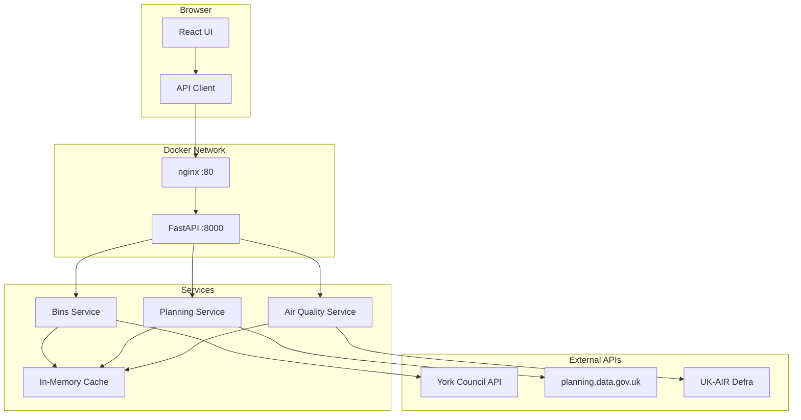

# Architecture Overview

> A comprehensive guide to the Local Council Data Explorer's system architecture, design patterns, and technical decisions.

---

## Table of Contents

- [System Overview](#system-overview)
- [High-Level Architecture](#high-level-architecture)
- [Component Diagram](#component-diagram)
- [Technology Stack](#technology-stack)
- [Design Principles](#design-principles)
- [Data Flow](#data-flow)
- [Integration Points](#integration-points)
- [Security Considerations](#security-considerations)
- [Scalability](#scalability)

---

## System Overview

The Local Council Data Explorer is a full-stack web application that aggregates and visualizes local council data from multiple UK government APIs. The architecture follows a **client-server pattern** with clear separation between the presentation layer (React/TypeScript frontend) and the business logic layer (FastAPI/Python backend).

### Core Objectives

| Objective | Implementation |
|-----------|----------------|
| **Data Aggregation** | Consolidate data from multiple council APIs into a unified interface |
| **Performance** | Minimize latency through intelligent caching and async operations |
| **Resilience** | Graceful degradation when external services are unavailable |
| **Developer Experience** | Mock mode for offline development and testing |
| **Type Safety** | Full TypeScript frontend + Pydantic models backend |

---

## High-Level Architecture

```
┌─────────────────────────────────────────────────────────────────────────────┐
│                              CLIENT TIER                                     │
│  ┌───────────────────────────────────────────────────────────────────────┐  │
│  │                         React Application                              │  │
│  │  ┌─────────────┐  ┌─────────────────┐  ┌─────────────────────────┐    │  │
│  │  │   Layout    │  │     Features    │  │       Components        │    │  │
│  │  │  Component  │  │ (bins/planning/ │  │   (Card, Charts, etc.)  │    │  │
│  │  │             │  │   air quality)  │  │                         │    │  │
│  │  └─────────────┘  └─────────────────┘  └─────────────────────────┘    │  │
│  │                              │                                         │  │
│  │  ┌───────────────────────────▼────────────────────────────────────┐   │  │
│  │  │                        Hooks (useApi)                          │   │  │
│  │  │        Async state management with loading/error handling      │   │  │
│  │  └────────────────────────────────────────────────────────────────┘   │  │
│  └───────────────────────────────────────────────────────────────────────┘  │
│                                      │                                       │
│                                      │ HTTP/REST (JSON)                      │
└──────────────────────────────────────┼───────────────────────────────────────┘
                                       │
                        ┌──────────────┴──────────────┐
                        │     nginx (Production)      │
                        │   Reverse Proxy / Static    │
                        └──────────────┬──────────────┘
                                       │
┌──────────────────────────────────────▼──────────────────────────────────────┐
│                              SERVER TIER                                     │
│  ┌────────────────────────────────────────────────────────────────────────┐ │
│  │                         FastAPI Application                            │ │
│  │                                                                        │ │
│  │  ┌────────────────────────────────────────────────────────────────┐   │ │
│  │  │                        Routers Layer                            │   │ │
│  │  │  ┌──────────────┐ ┌───────────────┐ ┌───────────────────────┐  │   │ │
│  │  │  │  bins.py     │ │  planning.py  │ │   air_quality.py      │  │   │ │
│  │  │  │  /api/bins   │ │ /api/planning │ │  /api/air-quality     │  │   │ │
│  │  │  └──────┬───────┘ └───────┬───────┘ └───────────┬───────────┘  │   │ │
│  │  └─────────┼─────────────────┼─────────────────────┼──────────────┘   │ │
│  │            │                 │                     │                   │ │
│  │  ┌─────────▼─────────────────▼─────────────────────▼──────────────┐   │ │
│  │  │                      Services Layer                            │   │ │
│  │  │  ┌────────────────┐ ┌────────────────┐ ┌────────────────────┐  │   │ │
│  │  │  │  bins_service  │ │planning_service│ │   air_service      │  │   │ │
│  │  │  │ - fetch/cache  │ │ - fetch/cache  │ │  - fetch/cache     │  │   │ │
│  │  │  │ - transform    │ │ - transform    │ │  - transform       │  │   │ │
│  │  │  │ - mock support │ │ - mock support │ │  - mock support    │  │   │ │
│  │  │  └────────────────┘ └────────────────┘ └────────────────────┘  │   │ │
│  │  └────────────────────────────┬───────────────────────────────────┘   │ │
│  │                               │                                        │ │
│  │  ┌────────────────────────────▼───────────────────────────────────┐   │ │
│  │  │                      Caching Layer                             │   │ │
│  │  │          InMemoryCache with TTL-based expiration               │   │ │
│  │  └────────────────────────────────────────────────────────────────┘   │ │
│  │                                                                        │ │
│  │  ┌────────────────────────────────────────────────────────────────┐   │ │
│  │  │                       Models Layer                              │   │ │
│  │  │         Pydantic schemas for validation & serialization         │   │ │
│  │  └────────────────────────────────────────────────────────────────┘   │ │
│  └────────────────────────────────────────────────────────────────────────┘ │
└─────────────────────────────────────────────────────────────────────────────┘
                                       │
                    ┌──────────────────┼──────────────────┐
                    ▼                  ▼                  ▼
┌─────────────────────────┐ ┌─────────────────────┐ ┌─────────────────────┐
│    EXTERNAL APIS        │ │   EXTERNAL APIS     │ │   EXTERNAL APIS     │
│                         │ │                     │ │                     │
│   City of York          │ │   planning.data     │ │     UK-AIR          │
│   Waste API             │ │    .gov.uk          │ │   Defra API         │
│                         │ │                     │ │                     │
│   Bin collection        │ │   Planning          │ │   Air quality       │
│   schedules             │ │   applications      │ │   measurements      │
└─────────────────────────┘ └─────────────────────┘ └─────────────────────┘
```

---

## Component Diagram



---

## Technology Stack

### Backend Technologies

| Component | Technology | Version | Purpose |
|-----------|------------|---------|---------|
| **Runtime** | Python | 3.11+ | Server-side programming language |
| **Framework** | FastAPI | Latest | Async web framework with automatic API docs |
| **Validation** | Pydantic | v2 | Data validation and settings management |
| **HTTP Client** | httpx | Latest | Async HTTP client for external APIs |
| **Server** | Uvicorn | Latest | ASGI server for production |
| **Configuration** | pydantic-settings | Latest | Environment-based configuration |
| **Testing** | pytest | 8.x | Unit and integration testing |

### Frontend Technologies

| Component | Technology | Version | Purpose |
|-----------|------------|---------|---------|
| **Runtime** | Node.js | 20+ | JavaScript runtime for build tools |
| **Framework** | React | 19 | Component-based UI library |
| **Language** | TypeScript | 5.9+ | Type-safe JavaScript |
| **Build Tool** | Vite | Latest | Fast bundler and dev server |
| **Charting** | Recharts | 3.x | Declarative chart components |
| **Linting** | ESLint | 9.x | Code quality enforcement |

### Infrastructure

| Component | Technology | Purpose |
|-----------|------------|---------|
| **Containerization** | Docker | Application containerization |
| **Orchestration** | Docker Compose | Multi-container orchestration |
| **Reverse Proxy** | nginx | Static file serving + API proxy |
| **CI/CD** | GitHub Actions | Automated testing and deployment |

---

## Design Principles

### 1. Separation of Concerns

Each layer has a single responsibility:

- **Routers**: HTTP request/response handling
- **Services**: Business logic and external API communication
- **Models**: Data validation and serialization
- **Cache**: Performance optimization

### 2. Dependency Injection

Services are injected into routers, enabling:

- Easy testing with mock services
- Swappable implementations
- Clear dependencies

### 3. Fail-Safe Defaults

The system degrades gracefully:

- Mock mode for offline development
- Fallback responses when external APIs fail
- Cached data served when possible

### 4. Type Safety

End-to-end type safety:

- Pydantic models validate all backend data
- TypeScript interfaces mirror backend schemas
- Compile-time error detection

---

## Data Flow

### Request Lifecycle

```
1. User Action (e.g., load bin collections)
        │
        ▼
2. React Component calls Feature API function
        │
        ▼
3. API function makes HTTP request to backend
        │
        ▼
4. FastAPI Router receives request
        │
        ▼
5. Router calls Service (via dependency injection)
        │
        ▼
6. Service checks cache
        │
        ├── Cache HIT → Return cached data
        │
        └── Cache MISS → Fetch from external API
                │
                ▼
7. External API response received
        │
        ▼
8. Service transforms data to internal model
        │
        ▼
9. Service caches result with TTL
        │
        ▼
10. Router returns JSON response
        │
        ▼
11. Frontend updates UI with new data
```

### Caching Strategy

| Data Type | TTL | Rationale |
|-----------|-----|-----------|
| **Bin Collections** | 1 hour | Schedules rarely change within a day |
| **Planning Applications** | 30 minutes | Status updates can occur throughout the day |
| **Air Quality** | 10 minutes | Real-time data, changes frequently |

---

## Integration Points

### External API Integration

| API | Endpoint | Authentication | Rate Limit |
|-----|----------|----------------|------------|
| City of York Waste | `/api/Collections` | None | Unknown |
| planning.data.gov.uk | `/entity.json` | None | Generous |
| UK-AIR Defra | `/AirQuality/*` | None | Unknown |

### Error Handling

```python
# Service layer catches and transforms errors
try:
    response = await client.get(url)
    response.raise_for_status()
except httpx.TimeoutException:
    raise HTTPException(503, "Service timed out")
except httpx.HTTPStatusError as e:
    if e.response.status_code == 404:
        return fallback_response()
    raise HTTPException(503, "External service error")
```

---

## Security Considerations

### Current Implementation

| Feature | Status | Notes |
|---------|--------|-------|
| Input Validation | ✅ Implemented | Pydantic validates all inputs |
| CORS | ✅ Configured | Restricted origins |
| HTTPS | ⚠️ Deployment | Handled by hosting platform |
| Rate Limiting | ❌ Not implemented | Consider for production |
| Authentication | ❌ Not required | Public read-only API |

### Recommendations for Production

1. **Rate Limiting**: Implement per-IP request limits
2. **API Keys**: Consider for usage tracking
3. **Audit Logging**: Log all API requests
4. **Security Headers**: Add CSP, HSTS, etc.

---

## Scalability

### Current Design (Single Instance)

- In-memory cache (lost on restart)
- Single backend process
- Suitable for low-moderate traffic

### Horizontal Scaling Path

```
                    ┌──────────────┐
                    │ Load Balancer │
                    └───────┬──────┘
              ┌─────────────┼─────────────┐
              ▼             ▼             ▼
        ┌──────────┐  ┌──────────┐  ┌──────────┐
        │ Backend  │  │ Backend  │  │ Backend  │
        │ Instance │  │ Instance │  │ Instance │
        └────┬─────┘  └────┬─────┘  └────┬─────┘
             └─────────────┼─────────────┘
                           ▼
                    ┌──────────────┐
                    │    Redis     │
                    │ Shared Cache │
                    └──────────────┘
```

### Scaling Recommendations

1. **Replace In-Memory Cache**: Use Redis for shared state
2. **Add Load Balancer**: nginx or cloud load balancer
3. **Horizontal Pod Autoscaling**: Kubernetes HPA
4. **CDN**: Cache static assets at the edge

---

## Related Documentation

- [Backend Structure](./BACKEND_STRUCTURE.md) - Detailed backend architecture
- [Frontend Structure](./FRONTEND_STRUCTURE.md) - Frontend component architecture
- [Deployment Guide](./DEPLOYMENT_GUIDE.md) - Production deployment instructions
- [API Reference](../API_REFERENCE.md) - Complete API documentation
