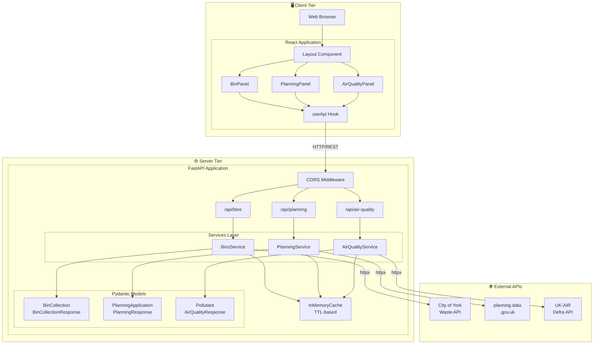
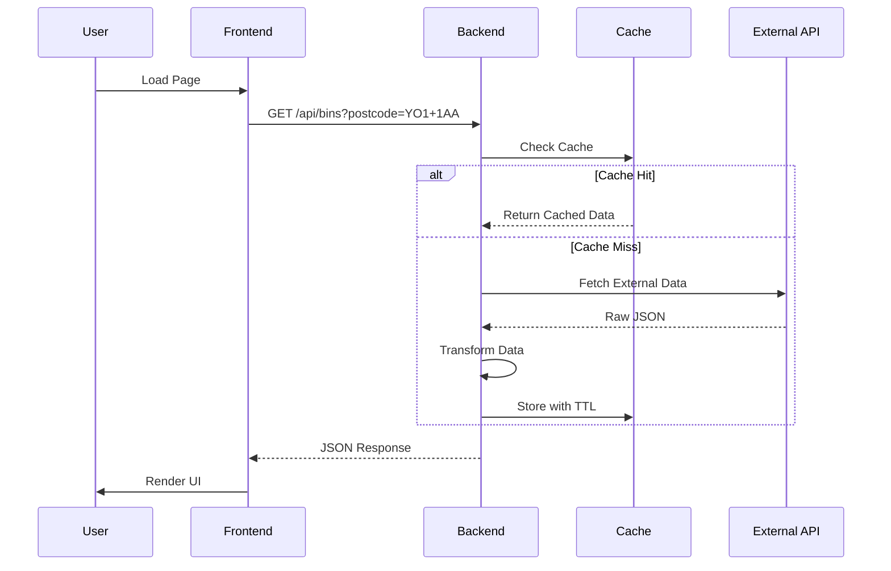
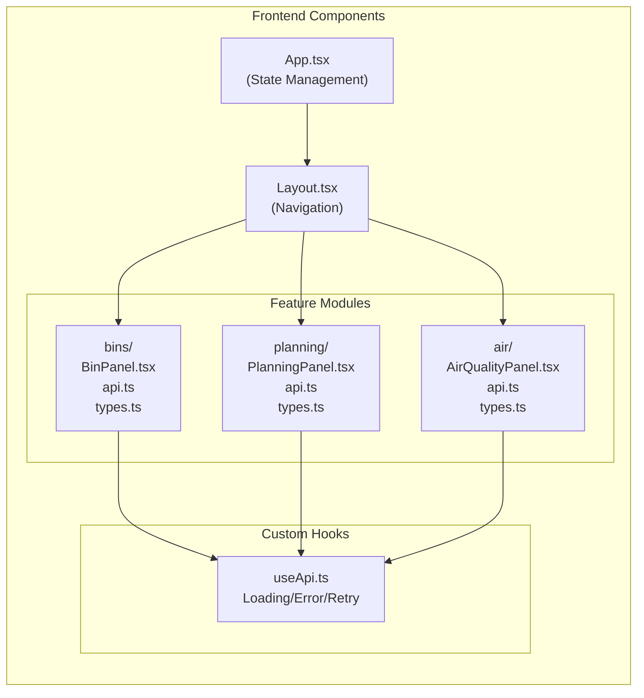
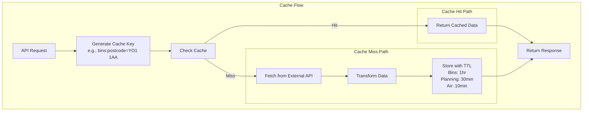
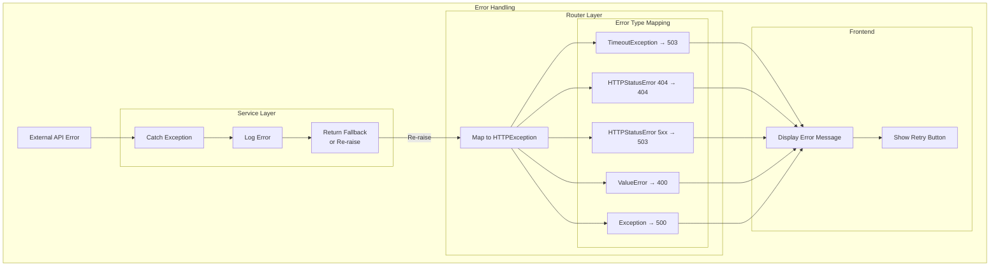
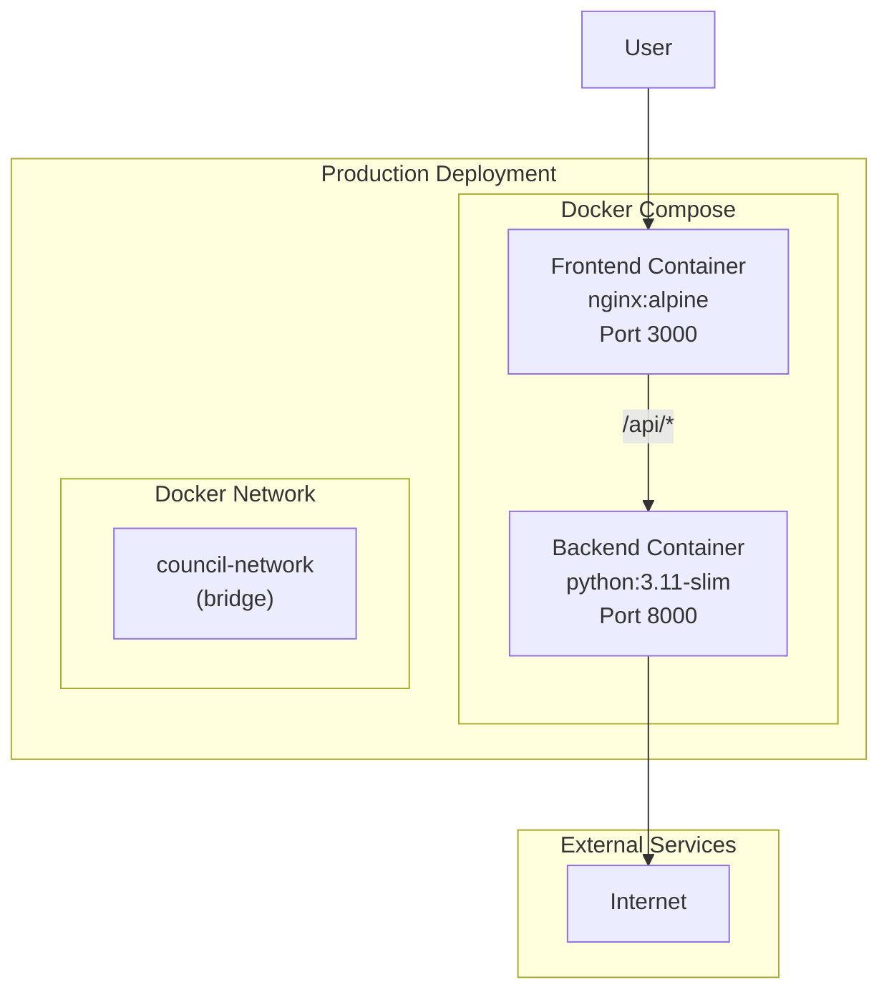

# System Architecture Diagram

This document contains the architecture diagram for the Local Council Data Explorer in Mermaid format.

## System Overview

## Data Flow Diagram

## Component Architecture

## Cache Strategy

## Error Handling Flow

## Deployment Architecture

---

## How to Render

These diagrams can be rendered in several ways:

1. **GitHub**: GitHub automatically renders Mermaid diagrams in markdown files
2. **VS Code**: Install the "Markdown Preview Mermaid Support" extension
3. **Mermaid Live Editor**: https://mermaid.live
4. **Export as SVG/PNG**: Use Mermaid CLI (`npx @mermaid-js/mermaid-cli`)

---

## Legend

| Symbol | Meaning |
|--------|---------|
| 🖥️ | Client-side component |
| ⚙️ | Server-side component |
| 🌐 | External API |
| → | Data flow |
| ⟷ | Bidirectional communication |
